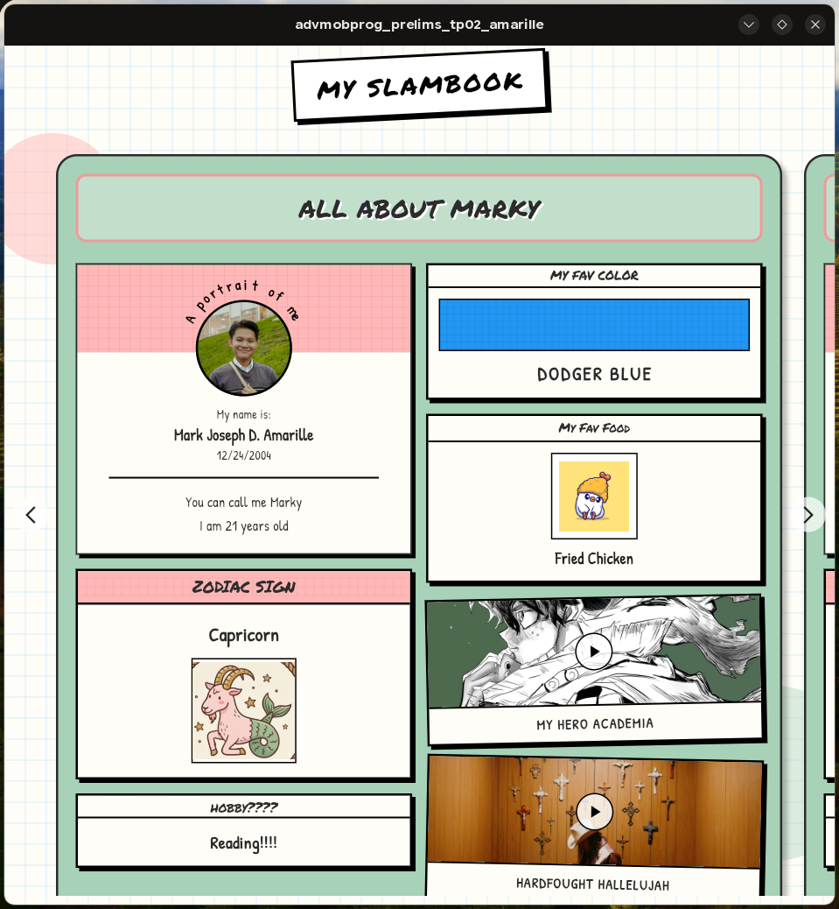

# SlamBook Application

This is an application I did for my class in Advance Mobile Programming. This is a static application where it displays a set of information based on the `friend.json` file in `assets/data/`.

I managed to explore flutter here and get the general gist on how this framework methodology works in how it treats the creation of an application.

## Showcase

| Marky's Page | Ron's Page |
| :---: | :---: |
|  |  |
